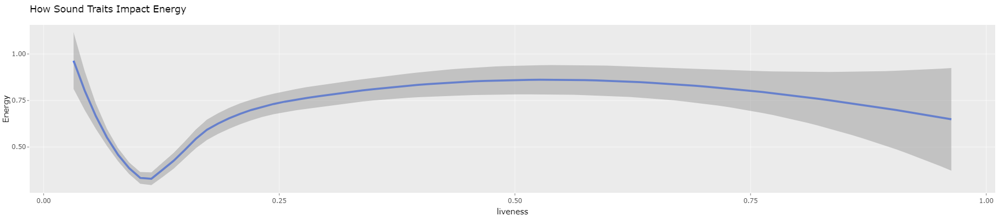

# Analyzing Music Trends
## INFO 201 "Foundational Skills for Data Science" — Winter 2023

Authors: Abigail Setiawan, June Mi Hong, Paul Lam

**Link: Link to your Shiny App here**

# Introduction

Throughout history, music has been an integral part of human culture and society. Whether it's through traditional folk songs, classical compositions, or modern pop hits, music has the ability to evoke powerful emotions and affect our behavior in a variety of ways.

One of the key factors that can influence our response to music is tempo. It is commonly known that fast-paced music with a strong beat can stimulate our bodies and energize us, while slower, more melodic music can have a calming effect and help us relax. The rhythm of a song can also play a role in our behavior, with syncopated rhythms often associated with excitement and anticipation, and steady rhythms associated with stability and grounding.

Melody is another characteristic of music that can affect our behavior. Major keys and uplifting melodies can create feelings of happiness and joy, while minor keys and melancholy melodies can evoke sadness or introspection. The use of different instruments, such as strings or percussion, can also contribute to the emotional impact of a piece of music.

Lyrics are yet another important factor that can influence our behavior in response to music. The words of a song can shape our perceptions and attitudes towards certain ideas or beliefs, and can even inspire us to take action or change our behavior. For example, songs with messages of hope and unity can encourage listeners to come together and work towards a common goal, while songs with negative or violent lyrics may have the opposite effect.

Understanding how music affects behavior can be an important tool for individuals, businesses, and even entire societies. For instance, businesses can use music strategically to create a certain mood or atmosphere in their stores, while individuals can use music to enhance their workouts, relaxation routines, or social experiences. Societies can use music to bring people together and promote cultural exchange, or to express political or social messages.

In conclusion, music is a powerful tool that can influence our thoughts, emotions, and behavior in a multitude of ways. By understanding the characteristics of music and how they impact us, we can use this knowledge to enhance our experiences and promote positive outcomes in our personal and professional lives.

[Dataset Link](https://www.kaggle.com/datasets/mrmorj/dataset-of-songs-in-spotify)

What, if any, ethical questions or questions of power do you need to consider when working with this data?

There are not any apparent questions of power or ethical questions to think about with our data.

What are possible limitations or problems with this data? 

In the case of the dataset that we chose, some characteristics in the form of numbers did not include a unit, which could be ambiguous to implicate since some characteristics have multiple units that could be applied, for example is the song length column. Another example is the key column which has numbers from 1-11 as indication of the key the song is played in, which is unclear what the numbers exactly represent in the music. For this reason, this data set could be hard to work with for people with no music knowledge as it does not include a code book or other forms of resources to provide detail on the columns. It is also unstated how and for what purpose the data was generated, so the legitimacy of the dataset is a subject to obscurity. Some of the dates inside the year category also do not have a specific date of release and only mentions the year it was released, which is inconsistent. Some columns in the dataset are also filled with “0” which could mean that those specific characters in the data are “0”, but it could also mean that some data are missing. Finally, the “mood” column in the data has a relatively narrow selection of moods, considering human’s complex emotions.

In this project, we will be answering three questions:

- How does a song's characteristics correlate to people’s reaction when listening to the song?

- How do the acousticness, instrumentalness, and liveness affect the song energy?

- Is the popularity of a song determined by its duration as well as its mood?

# Conclusion

## Final Takeaways

The analysis of the power of music has revealed that music is a universal language that can connect people from different backgrounds and cultures. Music has the ability to evoke emotions, enhance cognitive function, and impact the human brain in various ways. As discussed, music can be used in a variety of settings, including education, therapy, and social environments, to improve mental and physical well being.

### Takeaway 1

With technology improving at a rapid rate, there is a a positive correlation between song popularity and the year in which it was released. As each year passes, the streams of the most popular song for that year is higher than the previous. This is due to the technological advances and switch from modern day stream services. As we can see in the chart1, the popularity of the most popular songs in the 2010's greatly surpasses the 90's and before because streaming services has made music accessible to almost everyone while in the 90's and before, they were relying on CD's, cassettes, vinyl, etc as a means of listening to music. Back then, people had to purchase individual songs/albums but in today world, everything is in the palm of our hands. Modern day steaming services have also made it easier for artist and producers to market as well through multiple platforms such as Instagram, Tiktok, Youtube, Spotify, etc. Modern technology and streaming services has allowed easier access to music which increases the the number of streams of the most popular song every year.

![Popularity of songs over the years](popular_songs_over_the_years.png "Overtime, the popularity of songs grows more and more"

### Takeaway 2

In regards to how do the acousticness, instrumentalness, and liveness affect the song energy, acousticness and instrumentalness have a negative impact on the energy of a song, whereas liveness has a positive impact. This means that songs with high levels of acousticness and instrumentalness tend to have a more relaxed and low energy sounds. On the other hand, songs with high levels of liveness, such as those recorded in front of a live audience, tend to have a more exciting and intense sound, which can be ideal for energetic playlists. This can be used by artist and producers when creating a song to have more acoustic and instrumental if they are going for a lower energy song or more of a liveness if they want to create lots of energy in their music.

 

### Takeaway 3

While there is a correlation between a song's duration and mood and its popularity, our analysis showed that these factors do not solely determine a song's success. Other factors such as the artist's reputation, marketing, and overall musical quality also play important roles in determining a song's popularity. Therefore, it is important for musicians and producers to focus on creating high-quality music that is both unique and appealing to their target audience, rather than solely relying on duration and mood as determinants of success. It is also important for both musicians and producers to have quality marketing campaigns to boost the popularity of songs. As shown on graph3, there are a couple out liars who have done exceptionally well even though their songs are over 5+ minutes or under 2. This is through their marketing strategy and quality of music.

### Conclusion

In conclusion, this analysis has shown that technology, acousticness, instrumentalness, liveness, and mood are all important factors that can influence people's reactions when listening to the song and its overall popularity. However, it is important to consider these factors in conjunction with other important elements such as musical quality and marketing to ensure that a song achieves success. At the end of the day, no matter how much data and research is done, only the artist and passion can make the song. By keeping these key takeaways in mind, musicians and producers can create music that resonates with their audience and stands out in today's competitive music industry. For instance, understanding the relationship between a song's characteristics and people's reactions can help music producers and artists create songs that their fans will relate to. Analyzing this can help find trends and patterns in the music industry before competition catches on the wave. Understanding their target audience can lead to increased revenue for music labels, streaming platforms, and artists themselves. All and all, even though this scenario is geared towards producers and artist, this analysis can be applied towards other industries to have a better understanding of their customers.