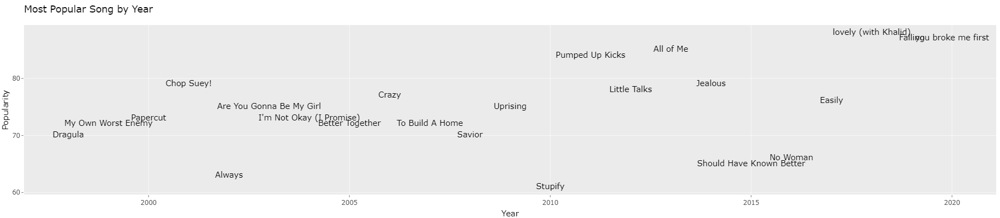
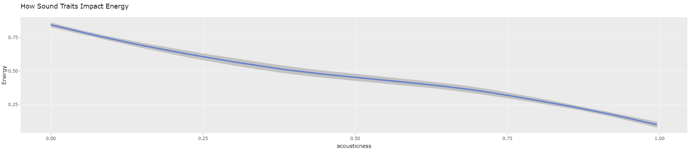
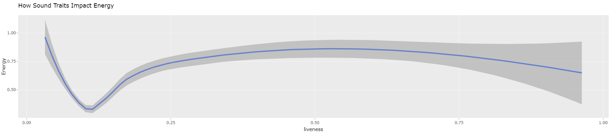

# Final Takeaways

The analysis of the power of music has revealed that music is a universal language that can connect people from different backgrounds and cultures. Music has the ability to evoke emotions, enhance cognitive function, and impact the human brain in various ways. As discussed, music can be used in a variety of settings, including education, therapy, and social environments, to improve mental and physical well being.

## Takeaway 1

With technology improving at a rapid rate, there is a a positive correlation between song popularity and the year in which it was released. As each year passes, the streams of the most popular song for that year is higher than the previous. This is due to the technological advances and switch from modern day stream services. As we can see in the chart1, the popularity of the most popular songs in the 2010's greatly surpasses the 90's and before because streaming services has made music accessible to almost everyone while in the 90's and before, they were relying on CD's, cassettes, vinyl, etc as a means of listening to music. Back then, people had to purchase individual songs/albums but in today world, everything is in the palm of our hands. Modern day steaming services have also made it easier for artist and producers to market as well through multiple platforms such as Instagram, Tiktok, Youtube, Spotify, etc. Modern technology and streaming services has allowed easier access to music which increases the the number of streams of the most popular song every year.

 "Overtime, the popularity of songs grows more and more"

## Takeaway 2

In regards to how do the acousticness, instrumentalness, and liveness affect the song energy, acousticness and instrumentalness have a negative impact on the energy of a song, whereas liveness has a positive impact. This means that songs with high levels of acousticness and instrumentalness tend to have a more relaxed and low energy sounds. On the other hand, songs with high levels of liveness, such as those recorded in front of a live audience, tend to have a more exciting and intense sound, which can be ideal for energetic playlists. This can be used by artist and producers when creating a song to have more acoustic and instrumental if they are going for a lower energy song or more of a liveness if they want to create lots of energy in their music.

 

## Takeaway 3

While there is a correlation between a song's duration and mood and its popularity, our analysis showed that these factors do not solely determine a song's success. Other factors such as the artist's reputation, marketing, and overall musical quality also play important roles in determining a song's popularity. Therefore, it is important for musicians and producers to focus on creating high-quality music that is both unique and appealing to their target audience, rather than solely relying on duration and mood as determinants of success. It is also important for both musicians and producers to have quality marketing campaigns to boost the popularity of songs. As shown on graph3, there are a couple out liars who have done exceptionally well even though their songs are over 5+ minutes or under 2. This is through their marketing strategy and quality of music.

## Conclusion

In conclusion, this analysis has shown that technology, acousticness, instrumentalness, liveness, and mood are all important factors that can influence people's reactions when listening to the song and its overall popularity. However, it is important to consider these factors in conjunction with other important elements such as musical quality and marketing to ensure that a song achieves success. At the end of the day, no matter how much data and research is done, only the artist and passion can make the song. By keeping these key takeaways in mind, musicians and producers can create music that resonates with their audience and stands out in today's competitive music industry. For instance, understanding the relationship between a song's characteristics and people's reactions can help music producers and artists create songs that their fans will relate to. Analyzing this can help find trends and patterns in the music industry before competition catches on the wave. Understanding their target audience can lead to increased revenue for music labels, streaming platforms, and artists themselves. All and all, even though this scenario is geared towards producers and artist, this analysis can be applied towards other industries to have a better understanding of their customers.

## Bonuce Facts
### *Rihanna's Super Bowl Performance*

Rihanna did an excellent job at all three takeaways. She utilized technology and social media platforms to get her performance out there. Even though she wasn't paid for her half time show performance, her and her teams marketing strategy brought in more half time show views (118.7 million viewers) than the Super Bowl itself (113 million viewers). She was able to bring lots of energy and captivate the audience with her live performance and extravagant backup dancers. Finally, she was able to capitalize after the Super Bowl with an increase of 211% in on-demand streams and a whopping 390% increase in her overall sales which just shows how powerful technology and social media is if marketed correctly. 

### *Frank Ocean Finessing the Music Industry*

In 2011, Frank Ocean was signed with Def Jam for a 5 year contract. Within those years, Frank Ocean used the "free" promotion provided by Def Jam to further his music career while locked in a two-album contact. He first dropped *Channel Orange*, an iconic album that was an instant hit. However, after falling out with Def Jam, Frank came up with a way to get out of the contract. He negotiated a deal with Apple music that allowed him to drop *Endless* and therefore completed all of the terms in his contract. He paid Def Jam back around $2 million and was able to finally get away from def jam. The next day, Frank ocean dropped one of his best albums ever, some might say the best, *Blonde*. Being out of the contract allowed Frank to keep all the rights to his new album. Frank Ocean was a genius when it came to marketing and utilized his resources to get out of his toxic contract. 

### *BTS*

Debuting in 2013, BTS is one of the most popular and well known in the world. With over 25 billion total streams on Spotify and over 28 billion views on Youtube, they have perfected the art of creating music and marketing. BTS's stans *AMRY*, have a reputation of of netoruoiusly selling out shows within miliseconds and resell going into the thousands. With great use of technology, marketing skills that reach world wide, high quality music, and amazing liveness in songs and IRL performances, BTS has nailed the formula for populairty in the music indistury. *Fun fact:* BTS makes up 0.5 to 0.7 percent of South Korea's GDP.

:max_bytes(150000):strip_icc():focal(979x595:981x597)/bts-members-1-03a9c478f1794c448bcb5f74bf94812c.jpg)
